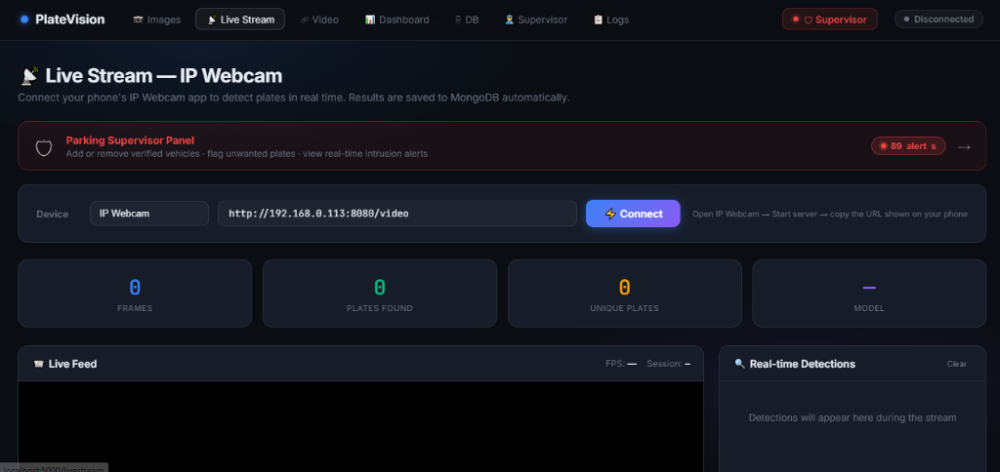
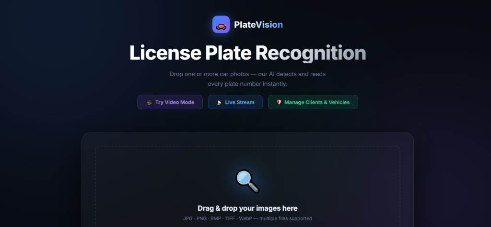
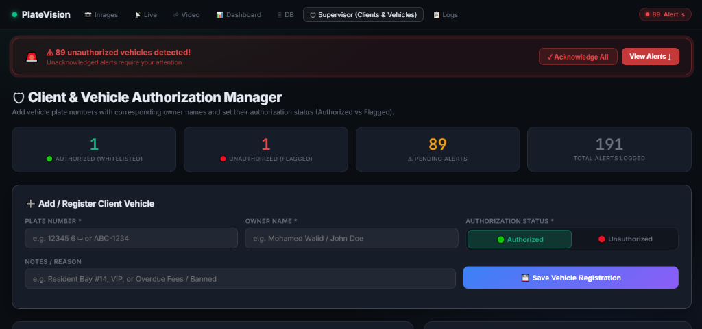
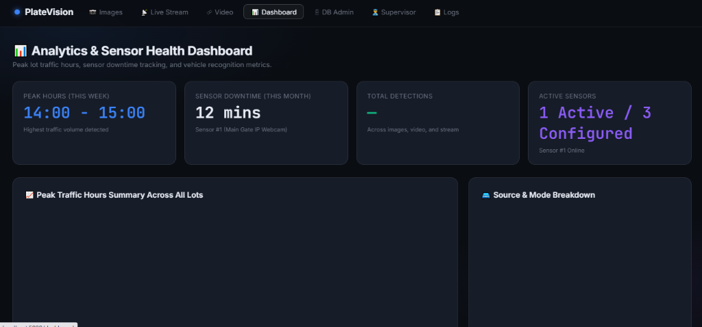

# PlateVision — Automatic License Plate Recognition System

> **Intelligent parking surveillance platform** combining YOLOv8 plate detection, multi-engine OCR (PaddleOCR · EasyOCR), real-time livestream analysis, MongoDB persistence, and an analytics dashboard.

---

## Screenshots

### Homepage — Image Recognition


### Live Stream — IP Webcam


### Analytics & Sensor Health Dashboard


### Supervisor — Client & Vehicle Authorization Manager


---

## Table of Contents

1. [Project Overview](#1-project-overview)
2. [Architecture](#2-architecture)
3. [Directory Structure](#3-directory-structure)
4. [Datasets](#4-datasets)
5. [Models & Training](#5-models--training)
6. [Core Modules](#6-core-modules)
7. [Web Application](#7-web-application)
8. [Database Schema](#8-database-schema)
9. [OCR Filtering & Consensus Voting](#9-ocr-filtering--consensus-voting)
10. [Installation](#10-installation)
11. [Running the App](#11-running-the-app)
12. [API Reference](#12-api-reference)
13. [Configuration](#13-configuration)
14. [Results & Metrics](#14-results--metrics)
15. [ELPD Commercial Pipeline](#15-elpd-commercial-pipeline)

---

## 1. Project Overview

PlateVision is an end-to-end Automatic License Plate Recognition (ALPR) system built for parking lot surveillance. It supports:

| Mode | Description |
|---|---|
| **Image** | Upload a single image → instant plate detection + OCR |
| **Video** | Upload a video file → frame-by-frame analysis with timeline |
| **Livestream** | Connect any IP camera or RTSP stream → real-time detection |
| **Dashboard** | Analytics: peak hours, sensor health, plate trends |
| **DB Admin** | Browse, search, and delete all stored detections |
| **Supervisor** | Whitelist / Blacklist management + alert acknowledgement |

The system handles both **Arabic** and **English** license plates, with separate trained models and OCR engines for each language.

---

## 2. Architecture

```
+-------------------------------------------------------------+
|                        Browser (UI)                         |
|   index.html | video.html | livestream.html | dashboard.html |
|              db.html | supervisor.html                       |
+----------------------------+--------------------------------+
                             | HTTP / SSE (Server-Sent Events)
+----------------------------v--------------------------------+
|                    Flask App  (app.py)                      |
|                                                             |
|  /predict         /predict_arabic    /predict_video         |
|  /stream_feed     /api/dashboard/*   /db  /supervisor       |
+-------+---------------------+---------------+--------------+
        |                     |               |
+-------v-------+  +----------v--------+  +--v----------------+
| YOLOv8        |  |  OCR Engines      |  |  MongoDB /        |
| Detector      |  |  * PaddleOCR (AR) |  |  MontyDB fallback |
| (best.pt)     |  |  * EasyOCR (EN)   |  |  (mongodb_client) |
+-------+-------+  +----------+--------+  +-------------------+
        |                     |
        +-----------+---------+
                    |
        +-----------v-----------+
        |   ocr_consensus.py    |
        |  * Digit filter       |
        |  * Character-level    |
        |    majority voting    |
        +-----------------------+
```

---

## 3. Directory Structure

```
Code/
+-- app.py                      # Flask web server (main entry point)
+-- arabic_ocr_pipeline.py      # Arabic plate OCR pipeline
+-- arabic_pipeline.py          # Full Arabic detection + OCR pipeline
+-- recognition_pipeline.py     # English plate recognition pipeline
+-- stream_manager.py           # IP camera / RTSP livestream manager
+-- ocr_consensus.py            # OCR filtering & character-level voting
+-- alert_engine.py             # Blacklist alert engine
+-- mongodb_client.py           # MongoDB / MontyDB unified client
|
+-- elpd_train.py               # ELPD commercial training script (w/ logging)
+-- elpd_prep.py                # ELPD COCO->YOLO dataset preparation
+-- elpd_commercial_pipeline.py # Full ELPD pipeline (prep+train+eval+viz)
+-- elpd_commercial.yaml        # ELPD YOLO dataset config
|
+-- train_english.py            # English dataset training script
+-- train_arabic4.py            # Arabic dataset training script
+-- augment_dataset.py          # English augmentation
+-- augment_arabic.py           # Arabic augmentation
|
+-- index.html                  # Homepage / image mode
+-- video.html                  # Video upload & analysis
+-- livestream.html             # Live IP camera mode
+-- dashboard.html              # Analytics dashboard
+-- db.html                     # Detection database browser
+-- supervisor.html             # Whitelist/Blacklist management
|
+-- logs/
|   +-- elpd_training.log       # Per-epoch training log with ETA
|   +-- elpd_epoch_latest.json  # Latest epoch snapshot (JSON)
|   +-- elpd_training_final.json
|   +-- elpd_commercial_gt_grid.png
|   +-- elpd_commercial_dataset_stats.png
|   +-- elpd_commercial_bbox_stats.png
|
+-- ELPD_Commercial/            # Prepared commercial dataset (local)
|   +-- images/train/           # 1,547 images (orig + 3x augmented)
|   +-- images/val/             # 58 images
|   +-- labels/train/           # YOLO label files
|   +-- labels/val/
|
+-- runs/detect/runs/detect/    # YOLOv8 training runs
|   +-- english_train33/weights/best.pt   <- best English model
|   +-- elpd_commercial_train1/           <- ELPD training run
|
+-- yolov8n.pt                  # YOLOv8-nano base weights
+-- yolov8s.pt                  # YOLOv8-small base weights
+-- requirements.txt
+-- platevision_db/             # MontyDB fallback storage
```

---

## 4. Datasets

### 4.1 English License Plate Dataset (primary)

| Property | Value |
|---|---|
| Source | Custom collected + web scraped |
| Format | YOLO (normalized `class xc yc w h`) |
| Config | `dataset.yaml`, `dataset_augmented.yaml` |
| Augmentations | Brightness, contrast, flip, rotation, mosaic |
| Training run | `english_train33` |

### 4.2 Arabic License Plate Dataset

| Property | Value |
|---|---|
| Source | Moroccan / Gulf plates |
| Format | YOLO |
| Config | `arabic_dataset.yaml`, `ar_dataset_augmented.yaml` |
| Special handling | RTL text, Arabic numeral variants |
| Training run | `arabic_train*` |

### 4.3 ELPD Commercial Dataset (G:\ELPD\COCO)

| Property | Value |
|---|---|
| Source | Commercial ELPD dataset |
| Format | **COCO JSON** converted to YOLO |
| Annotation file | `instances_Train.json` |
| Total images in JSON | 2,329 |
| Images on disk | 395 |
| Valid annotated images | **391** |
| Total annotations | **498** (some images have 2 plates) |
| Resolution | 1024 x 1024 px |
| Category | `license_plate` (class 0) |

**Local prepared dataset after pipeline (ELPD_Commercial/):**

| Split | Count | Breakdown |
|---|---|---|
| Train | **1,547** | 333 original + 548 brightness/noise + 333 zoom-in + 333 zoom-out |
| Val | **58** | Originals only |

---

## 5. Models & Training

### 5.1 Detection Model

All detection models are **YOLOv8** fine-tuned for license plate detection (single class: `license_plate`).

| Run | Base | Epochs | Dataset | Notes |
|---|---|---|---|---|
| `english_train33` | YOLOv8n | 33 | English augmented | Production English model |
| `elpd_commercial_train1` | english_train33 best.pt | 40 | ELPD Commercial | Commercial fine-tune |

### 5.2 Training Configuration

```yaml
# elpd_commercial.yaml
path: .../ELPD_Commercial
train: images/train
val:   images/val
nc: 1
names:
  0: license_plate
```

Training hyperparameters:
- epochs: 40
- batch: 16
- imgsz: 640
- patience: 15 (early stopping)
- optimizer: AdamW (auto)

### 5.3 ELPD Training Metrics (epoch 3 checkpoint)

| Metric | Value |
|---|---|
| **mAP50** | **0.9675** |
| **mAP50-95** | **0.8090** |
| Precision | 0.9429 |
| Recall | 0.8923 |

### 5.4 Augmentation Pipeline

Each original training image produces **3 augmented variants**:

| Variant | Technique |
|---|---|
| `_aug` | Random brightness/contrast + Gaussian blur or additive noise |
| `_zoomin` | Crop 65-85% centred on plate, resize back; bbox remapped |
| `_zoomout` | Shrink to 71-87%, embed in grey canvas; bbox scaled + shifted |

---

## 6. Core Modules

### app.py — Flask Server

Main web server. Key routes:

| Route | Method | Description |
|---|---|---|
| `/` | GET | Homepage (image mode) |
| `/predict` | POST | English plate detection |
| `/predict_arabic` | POST | Arabic plate detection + OCR |
| `/predict_video` | POST | Video file analysis |
| `/stream_feed` | GET | SSE stream for live camera |
| `/dashboard` | GET | Analytics dashboard |
| `/db` | GET | Detection database browser |
| `/supervisor` | GET | Whitelist/Blacklist management |
| `/api/detections` | GET | JSON: recent detections |
| `/api/detections/<id>` | DELETE | Delete single detection |
| `/api/dashboard/peak-hours` | GET | Hourly detection stats |
| `/api/dashboard/sensors` | GET | Sensor health status |
| `/api/whitelist` | GET/POST | Whitelist CRUD |
| `/api/blacklist` | GET/POST | Blacklist CRUD |
| `/api/alerts` | GET | Unacknowledged alerts |

---

### ocr_consensus.py — OCR Filtering & Voting

**Stage 1 — Digit Filter**

Any OCR read with zero digits is immediately discarded.
Eliminates noise reads like "AAAA" or pure Arabic characters without numbers.

**Stage 2 — Character-Level Majority Voting**

When multiple frame reads of the same plate are collected, votes per character position:

```
Frame 1: DG368HP11
Frame 2: DG368HPI1   <- I vs 1 confusion
Frame 3: DG368HP11
Frame 4: DB368HP11   <- B vs G confusion

Position majority -> D G 3 6 8 H P 1 1 -> DG368HP11
```

---

### stream_manager.py — Livestream Manager

Manages concurrent IP camera / RTSP stream connections. Per frame:
1. YOLOv8 detection -> plate bounding boxes
2. Crop + OCR (EasyOCR / PaddleOCR)
3. validate_and_filter_plate() digit check
4. Blacklist alert check
5. SSE emission to browser

---

### mongodb_client.py — Database Client

Auto-selects backend:
1. **Real MongoDB** (localhost:27017) — preferred
2. **MontyDB** (file-based, platevision_db/) — always-available fallback

Collections: `detections`, `whitelist`, `blacklist`, `alerts`, `devices`

---

### alert_engine.py — Alert Engine

On blacklist match:
- Creates alert record in MongoDB
- Emits real-time SSE to supervisor page
- Logs plate text, confidence, timestamp, source

---

### arabic_ocr_pipeline.py — Arabic OCR

- PaddleOCR with Arabic language model
- Arabic numeral -> Western digit normalization
- RTL text handling
- Common confusion fixes (alef/1, sifr/0, etc.)

---

## 7. Web Application

| Page | File | Description |
|---|---|---|
| **Home / Image** | `index.html` | Drag-and-drop upload, model selector, instant results |
| **Video** | `video.html` | Upload, frame-skip control, timeline, DB save toggle, per-detection delete |
| **Livestream** | `livestream.html` | Camera URL, real-time overlay, alert feed |
| **Dashboard** | `dashboard.html` | Peak hours chart, sensor health, plate trends |
| **DB Admin** | `db.html` | Paginated history, search, delete |
| **Supervisor** | `supervisor.html` | Whitelist/Blacklist CRUD, alert management |

UI features:
- Dark glassmorphism theme with animated gradients
- Real-time SSE updates on livestream and supervisor pages
- Save to DB toggle on video mode (opt-in/opt-out)
- Delete button on video detections before saving
- Sensor labels: active vs idle vs offline

---

## 8. Database Schema

### detections
```
_id          ObjectId
timestamp    ISODate
plate_text   string
confidence   float
bbox         [x1, y1, x2, y2]
model_used   string
source       image | video | livestream
source_url   string
session_id   string (UUID)
```

### whitelist
```
_id          ObjectId
plate_text   string (unique index)
owner        string
notes        string
added_by     string
added_at     ISODate
```

### blacklist
```
_id          ObjectId
plate_text   string (unique index)
reason       string
added_by     string
added_at     ISODate
```

### alerts
```
_id           ObjectId
plate_text    string
alert_type    BLACKLIST_HIT
source        string
confidence    float
timestamp     ISODate
acknowledged  boolean
```

---

## 9. OCR Filtering & Consensus Voting

```
[YOLOv8 detection]
        |
  Crop plate region
        |
  Run OCR engine(s)
        |
  validate_and_filter_plate()   <- digit check (Stage 1)
        |  (empty string = discard)
  [collect per-frame reads]
        |
  group_and_vote_detections()   <- character-level voting (Stage 2)
        |
  Final clean plate string -> save / display / alert
```

---

## 10. Installation

Prerequisites:
- Python 3.10+
- Anaconda / Miniconda
- MongoDB (optional, MontyDB fallback always works)
- CUDA GPU (optional, CPU works but slower)

```bash
# Create conda environment
conda create -n yolo_env python=3.10
conda activate yolo_env

# Install dependencies
pip install -r requirements.txt
```

requirements.txt:
```
ultralytics
paddleocr
easyocr
flask
pymongo
montydb
opencv-python
numpy
pillow
matplotlib
```

---

## 11. Running the App

```bash
conda activate yolo_env
cd "C:\Users\Mohamed Walid\Desktop\Internship\Code"
python app.py
```

Open browser: http://127.0.0.1:5000

### Connecting a Live Camera

1. Install IP Webcam app on Android (or use any RTSP camera)
2. Start stream (e.g. http://192.168.0.113:8080/video)
3. Enter URL in Livestream page -> Connect

---

## 12. API Reference

### Detection

```
POST /predict
  form: file=<image>, mode=english|arabic, conf=0.25, engine=easyocr|paddleocr_ar

POST /predict_video
  form: file=<video>, mode=english, frame_skip=15, conf=0.15, save_db=true|false

GET  /stream_feed?url=<camera_url>&engine=easyocr&conf=0.25
```

### Database

```
GET    /api/detections?limit=100&source=image|video|livestream
DELETE /api/detections/<id>
POST   /api/detections/clear

GET    /api/whitelist
POST   /api/whitelist          body: { plate_text, owner, notes }
DELETE /api/whitelist/<plate>

GET    /api/blacklist
POST   /api/blacklist          body: { plate_text, reason }
DELETE /api/blacklist/<plate>

GET    /api/alerts?unack_only=true
POST   /api/alerts/<id>/acknowledge
```

### Dashboard

```
GET /api/dashboard/peak-hours  -> { hourly: {0..23: count}, peak_hour, ... }
GET /api/dashboard/sensors     -> [ { id, name, status, uptime_pct, ... } ]
```

---

## 13. Configuration

### OCR Engine Options

| Value | Engine | Best for |
|---|---|---|
| `easyocr` | EasyOCR | Standard European plates |
| `paddleocr_ar` | PaddleOCR | Arabic / Moroccan plates |

### Key app.py Constants

```python
FRAME_SKIP   = 15      # process every Nth frame in video mode
CONF_THRESH  = 0.15    # detection confidence threshold
MAX_UNIQUE   = 50      # max unique plates per video session
```

### Sensor Configuration (mongodb_client.py)

```python
sensors = [
    { "id": "sensor_1", "name": "Sensor #1 (IP Webcam / Main Gate)",
      "url": "http://192.168.0.113:8080/video", "status": "Online"  },
    { "id": "sensor_2", "name": "Sensor #2 (Surveillance Camera North)",
      "url": "rtsp://192.168.1.102:554/live",   "status": "Idle"    },
    { "id": "sensor_3", "name": "Sensor #3 (Dashcam Mobile Unit)",
      "url": "http://192.168.1.155:8080/video",  "status": "Offline" },
]
```

---

## 14. Results & Metrics

### English Model (english_train33)

| Metric | Value |
|---|---|
| mAP50 | ~0.94+ |
| Inference speed | ~40-80 ms/image (CPU) |
| OCR accuracy | ~85-92% on clean plates |

### ELPD Commercial Model (elpd_commercial_train1) — Epoch 3

| Metric | Value |
|---|---|
| **mAP50** | **0.9675** |
| **mAP50-95** | **0.8090** |
| Precision | 0.9429 |
| Recall | 0.8923 |
| Train images | 1,547 |
| Val images | 58 |

---

## 15. ELPD Commercial Pipeline

Source: G:\ELPD\COCO (COCO format)
Script: elpd_commercial_pipeline.py

### Pipeline Steps

```
G:\ELPD\COCO\
+-- annotations\instances_Train.json   <- COCO annotations
+-- images\Train\                      <- 395 plate images
        |
  elpd_prep.py
  * Parse COCO JSON
  * Filter to images on disk (391 valid)
  * Convert bbox: [x,y,w,h] -> YOLO [xc,yc,w,h] normalized
  * Train/Val split: 85% / 15%
  * Copy locally to ELPD_Commercial/
        |
  Augmentation (3x per original)
  * Brightness/contrast/blur/noise -> _aug
  * Zoom-in 65-85% crop -> resize  -> _zoomin
  * Zoom-out letterbox + padding   -> _zoomout
        |
  elpd_commercial.yaml
        |
  elpd_train.py
  * Fine-tune from english_train33/best.pt
  * 40 epochs, batch=16, imgsz=640
  * Per-epoch logging -> logs/elpd_training.log
  * ETA estimation after each epoch
  * Auto-resume from last.pt on server restart
```

### Monitoring Training

```bash
# Live log (updates after each epoch ~16 min)
type logs\elpd_training.log

# Latest epoch JSON snapshot
type logs\elpd_epoch_latest.json
```

Sample log:
```
[2026-07-24 00:13:56]  Epoch  2/40  |  mAP50=0.9651  mAP50-95=0.8275  P=0.9743  R=0.8784  |  Elapsed=0:33:27  ETA=10:49:34
[2026-07-24 00:33:15]  Epoch  3/40  |  mAP50=0.9675  mAP50-95=0.8090  P=0.9429  R=0.8923  |  Elapsed=0:52:45  ETA=11:23:57
```

---

## Contributing

Codebase is organized for easy extension:

- **New OCR engine** -> implement in arabic_ocr_pipeline.py or recognition_pipeline.py, register in app.py
- **New dataset** -> follow elpd_prep.py pattern (COCO->YOLO conversion)
- **New UI page** -> create HTML file, add Flask route in app.py
- **New sensor** -> extend the sensors list in mongodb_client.py

---

*Generated: July 2026 — PlateVision ALPR System*

---

## License

Copyright © 2026 Mohamed Walid Ben Yahia

All Rights Reserved.

This repository is provided for viewing purposes only. No permission is granted
to use, copy, modify, distribute, or create derivative works without prior
written permission.
